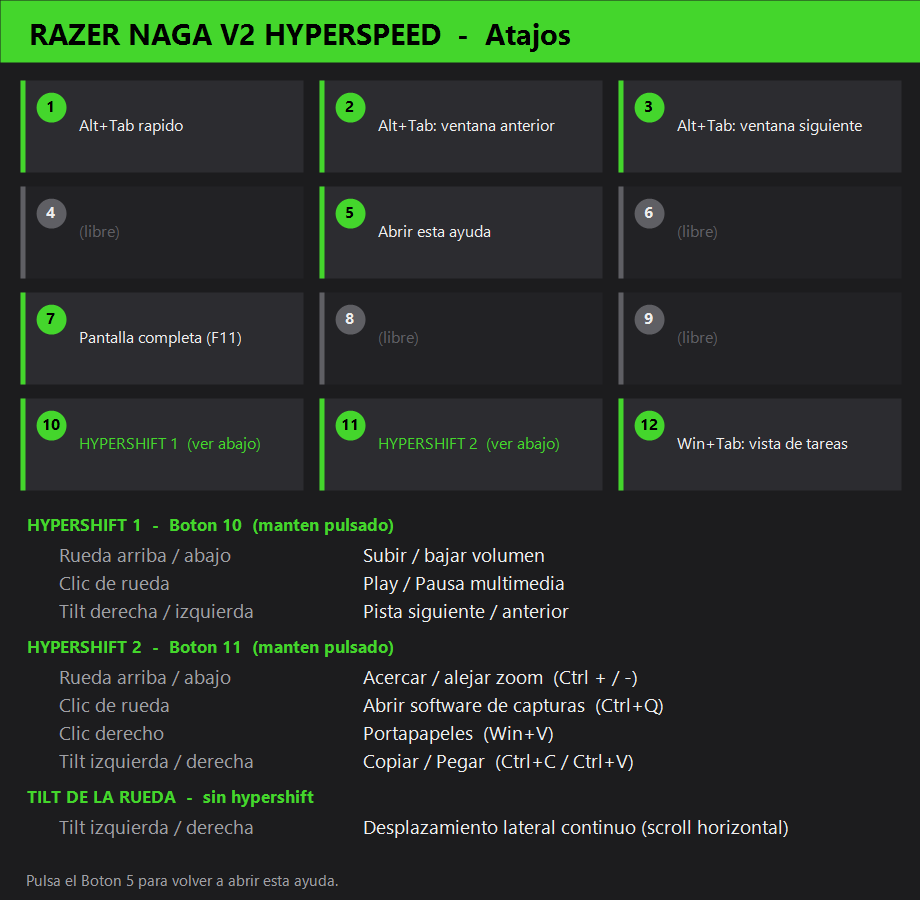

# Razer Naga V2 Hyperspeed — Macros (Windows + Linux)

Macros para los **12 botones laterales** del ratón Razer Naga V2 Hyperspeed,
con dos modos **Hypershift**, un selector **Alt+Tab persistente** y soporte
para el **tilt** de la rueda.

El mismo conjunto de atajos está implementado para los dos sistemas:

| Sistema | Archivo | Tecnología |
|---------|---------|------------|
| **Windows** | [`NagaV2_Macros.ahk`](NagaV2_Macros.ahk) | AutoHotkey v2 |
| **Linux** (Wayland/X11) | [`naga_macros.py`](naga_macros.py) | Python + `evdev`/`uinput` |

---

## Cómo está montado el ratón

Los 12 botones laterales **no** ejecutan las macros por sí mismos: en
**Razer Synapse** se configuraron para enviar las teclas **F13 → F24**, y
estos scripts "capturan" esas teclas y ejecutan la acción correspondiente.

> La asignación F13–F24 conviene **guardarla en la memoria interna del ratón**
> (perfil *onboard*). Así también funciona en Linux, donde Synapse no existe.

Correspondencia botón → tecla:

| Botón | Tecla | | Botón | Tecla |
|:----:|:----:|:--:|:----:|:----:|
| 1 | F13 | | 7  | F19 |
| 2 | F14 | | 8  | F20 |
| 3 | F15 | | 9  | F21 |
| 4 | F16 | | 10 | F22 |
| 5 | F17 | | 11 | F23 |
| 6 | F18 | | 12 | F24 |

---

## Mapa de atajos



### Botones simples

| Botón | Acción |
|:----:|--------|
| **1** | Alt+Tab rápido (un toque) |
| **2** | Selector Alt+Tab persistente — ventana **anterior** |
| **3** | Selector Alt+Tab persistente — ventana **siguiente** |
| **4** | *(libre)* |
| **5** | Abrir esta guía de atajos (imagen) |
| **6** | *(libre)* |
| **7** | Pantalla completa (`F11`) |
| **8** | *(libre)* |
| **9** | *(libre)* |
| **12** | Vista de tareas — `Win+Tab` (Windows) / Actividades-Super (Linux) |

### Hypershift 1 — Botón 10 (mantener pulsado)

| Combinación | Acción |
|-------------|--------|
| Rueda arriba / abajo | Subir / bajar volumen |
| Clic de rueda | Play / Pausa multimedia |
| Tilt derecha / izquierda | Pista siguiente / anterior |

### Hypershift 2 — Botón 11 (mantener pulsado)

| Combinación | Acción |
|-------------|--------|
| Rueda arriba / abajo | Acercar / alejar zoom (`Ctrl +` / `Ctrl -`) |
| Clic de rueda | `Ctrl+Q` (abrir software de capturas) |
| Clic derecho | Portapapeles (`Win+V` en Windows) |
| Tilt izquierda / derecha | Copiar / Pegar (`Ctrl+C` / `Ctrl+V`) |

---

## Windows

### Requisitos
- [AutoHotkey **v2**](https://www.autohotkey.com/) (¡v2, no v1!).

### Uso
1. Doble clic en `NagaV2_Macros.ahk`.
2. Aparece un icono verde **"H"** en la bandeja del sistema.
3. Tras editar el script: clic derecho en el icono → **Reload Script**.

### Arranque automático con Windows
Crea un acceso directo del `.ahk` en la carpeta de Inicio:

1. `Win + R` → escribe `shell:startup` → Enter.
2. Copia ahí un acceso directo de `NagaV2_Macros.ahk`.

A partir de entonces el script se lanza solo al iniciar sesión.
Para desactivarlo: borra el acceso directo de esa carpeta (o desde
**Administrador de tareas → Inicio**).

> La guía de atajos (`NagaV2_atajos.png`) debe estar **en la misma carpeta** que el
> `.ahk`, porque el Botón 5 la abre con `A_ScriptDir`.

---

## Linux (Ubuntu — Wayland o X11)

AutoHotkey no existe en Linux, así que se usa un demonio en Python que lee el
ratón con `evdev` e inyecta las teclas con `uinput` (a nivel de kernel, por
eso funciona **igual en Wayland y X11**).

### Requisitos
```bash
sudo apt install python3-evdev      # o:  pip install evdev
```

### Configuración
Edita las constantes al principio de `naga_macros.py`:

- `IMAGE_PATH` → ruta de la guía de atajos en Linux (p. ej. `~/Imagenes/NagaV2_atajos.png`).
- `DEVICE_NAME_CONTAINS` → texto del nombre del ratón (por defecto `"naga"`).
- `ALTTAB_TIMEOUT`, `TILT_DEBOUNCE`, `WHEEL_STEPS` → ajustes finos.

### Uso
```bash
sudo python3 naga_macros.py
```
Al arrancar imprime los dispositivos detectados (el Naga debe aparecer, y la
interfaz de ratón marcada como `(capturado)`).

### Ejecutar sin `sudo`
1. Añade tu usuario al grupo `input` y reinicia sesión:
   ```bash
   sudo usermod -aG input $USER
   ```
2. Permite el acceso a `/dev/uinput` con una regla udev:
   ```bash
   echo 'KERNEL=="uinput", MODE="0660", GROUP="input", OPTIONS+="static_node=uinput"' \
     | sudo tee /etc/udev/rules.d/99-uinput.rules
   sudo udevadm control --reload-rules && sudo udevadm trigger
   ```

### Arranque automático (servicio systemd de usuario)
Crea `~/.config/systemd/user/naga-macros.service`:

```ini
[Unit]
Description=Macros Razer Naga V2

[Service]
ExecStart=/usr/bin/python3 %h/ruta/al/repo/naga_macros.py
Restart=on-failure

[Install]
WantedBy=default.target
```
Actívalo:
```bash
systemctl --user daemon-reload
systemctl --user enable --now naga-macros.service
```

---

## Diferencias Windows ↔ Linux

| Atajo | Windows | Linux (notas) |
|-------|---------|---------------|
| Portapapeles (HS2 + clic derecho) | `Win+V` nativo | `Super+V` **no** es nativo; requiere un gestor (GPaste / CopyQ) con ese atajo |
| Vista de tareas (Botón 12) | `Win+Tab` | Tecla **Super** (Actividades de GNOME) |
| `Ctrl+Q` (capturas) | Tu software de capturas | Asegúrate de que tu app de capturas en Linux use el mismo atajo |

---

## Detalles técnicos

- **Selector Alt+Tab persistente (botones 2 y 3):** mantiene `Alt` pulsado
  entre pulsaciones y lo suelta tras un periodo de inactividad
  (`ALTTAB_TIMEOUT`, por defecto 0.8 s). En AHK requiere el prefijo `*` y el
  modo `{Blind}` para no cerrar el selector en cada pulsación.
- **Hypershift:** los botones 10 y 11 actúan como modificador mientras se
  mantienen pulsados; la rueda/tilt/clics cambian de función y el scroll
  normal se suprime.
- **Anti-repetición del tilt:** mantener el tilt genera muchos eventos
  seguidos; copiar, pegar y cambio de pista se ejecutan **una sola vez** por
  inclinación (`TILT_DEBOUNCE`, por defecto 0.4 s).

---

## Estructura del repo

```
.
├── NagaV2_Macros.ahk        # Windows (AutoHotkey v2)
├── naga_macros.py           # Linux (Python evdev/uinput)
├── generar_guia_atajos.ps1  # Genera la imagen NagaV2_atajos.png
├── NagaV2_atajos.png        # Guía de atajos (la abre el Botón 5)
├── CLAUDE.md                # Contexto para mantener el repo
└── README.md
```
